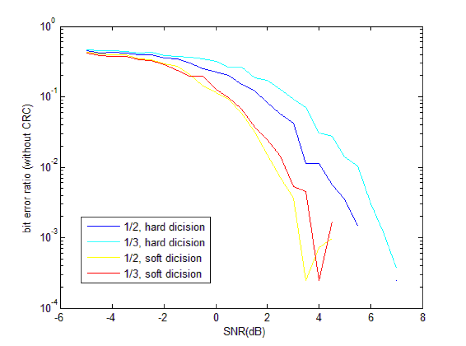
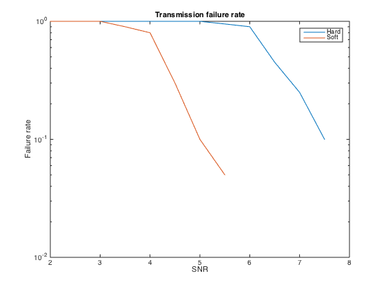

% 信道编码
% 无36
  李思涵
  2013011187
  <lisihan969@gmail.com>
% \today

# API 设计 & 分工

我们组的成员如下：

- 2013011187 李思涵
- 2013011212 刘家硕
- 2013011166 陈馨瑶

我们将任务分成了三部分，其中我负责完成第二部分。

## Part I

### 编码器 `conv_encode`

包括二进制 1/2 和 1/3 效率卷积码

- 输入：原符号（logical array），是否收尾（logical），效率（2/3），CRC多项式（logical array）
- 输出：编码后符号（logical array）

### 画图

- 1/2, 1/3, 硬/软判决误比特率 - 信道信噪比
- 10个典型误码图案
- 文件传输失败率 - 信噪比
- 文件整体差错率 - 信道信噪比
- 信道发端/收端复基带星座图

## Part II

### 符号 - 电平映射

1/2 效率使用 4PSK，1/8 效率使用 8PSK。

#### 映射 `sym_encode`

- 输入：符号（logical array），效率（2/3）
- 输出：电平（complex array）

#### 解映射（硬判决） `sym_decode`

根据欧氏距离

- 输入：电平（complex array），效率（2/3）
- 输出：符号（logical array）

### 信道 `transmit`

- 输入：信号（complex array），信噪比（double）
- 输出：加噪声后电平（complex array）

### 发射函数 `conv_send`

结合上面两个

- 输入：原符号（logical array），是否收尾（logical），效率（2/3），CRC多项式（logical array）
- 输出：电平（complex array）

### 接收函数 `conv_receive`

`conv_decode` 的别名。

### CRC

#### 编码 `crc_encode`

会在序列末尾填 0，直到序列长度变为帧长度的整数倍。

- 输入：原符号（logical array），CRC多项式（logical array），
  帧长度（课件中为 25 * 8）
- 输出：加 CRC 后符号（logical array）

#### 解码 `crc_decode`

25字节一组

- 输入：加 CRC 后符号（logical array），CRC多项式（logical array），
  帧长度（课件中为 25 * 8）
- 输出：原符号（logical array），误块率（double）

## Part III

### 译码器 `conv_decode`

欧氏距离

硬判决，软判决

包括二进制 1/2 和 1/3 效率卷积码

- 输入：加噪声后电平（complex array），是否收尾（logical），效率（2/3），CRC多项式（logical array），硬判决（logical）
- 输出：解码后符号（logical array），误块率（double）   

# 模块实现

以下列出了我负责部分的实现代码。

## 符号 - 电平映射

根据效率选取映射方式，将信号映射到复电平。为了方便软解码，1/2 效率使用 4PSK，1/8 效率使用 8PSK，并采用格雷码编码。理论星座图如图所示。


### 符号 > 电平

```matlab
function signal = sym_encode(symbols, efficiency)
    if efficiency == 2
        gray = [0 1 3 2];
        weight = [2; 1];
    else
        gray = [0 1 3 2 6 7 5 4];
        weight = [4; 2; 1];
    end

    levels = 2^efficiency;
    signal_num = floor(length(symbols) / efficiency);
    signal = zeros(signal_num, 1);

    for k = 1:signal_num
        symbols((k-1)*efficiency+1:k*efficiency)';
        num = symbols((k-1)*efficiency+1:k*efficiency)' * weight;
        level = find(gray == num);
        signal(k) = exp(j * (level - 1) * 2 * pi / levels);
    end
end
```

### 电平 > 符号

这里实现的电平 > 符号映射是根据接受信号在复平面上的幅角来判定的。

可以证明，这种判定方式和以欧拉距离判决等价。

```matlab
function symbols = sym_decode(signal, efficiency)
    if efficiency == 2
        gray = [0 1 3 2];
    else
        gray = [0 1 3 2 6 7 5 4];
    end

    levels = 2^efficiency;
    signal = gray(mod(round(angle(signal) / (2 * pi / levels)), levels) + 1);

    symbols = de2bi(signal, efficiency, 'left-msb')';
    symbols = symbols(:);
end
```

## 模拟信道

使用 AWGN 信道，对复电平序列以一定的信噪比加上高斯白噪声。
其中实部和虚部的噪声为独立同分布的高斯分布。

```matlab
function noised_signal = transmit(signal, snr)
    noised_signal = awgn(signal, snr, 'measured');
end
```

## CRC

选取多项式为 CRC12

\[
  x^{12} + x^{11} + x^3 + x^2 + x + 1
\]

### CRC 编码


首先在序列的末尾填 0，直到序列长度变为帧长度的整数倍。

然后对每个帧补零后，用该多项式对每个帧进行模 2 除，将余数添加在该帧后作为校验和。

```matlab
function crced_symbols = crc_encode(symbols, crc_poly, frame_size)
    frames = ceil(length(symbols) / frame_size);
    pad = frames * frame_size - length(symbols);
    symbols = [symbols; zeros(pad, 1)];

    symbols = reshape(symbols, frame_size, frames);
    crced_symbols = padarray(symbols, [length(crc_poly) - 1, 0], 'post');

    for col = 1:frames
        for row = 1:frame_size
            if crced_symbols(row, col)
                crced_symbols(row:row+length(crc_poly)-1, col) = ...
                    xor(crced_symbols(row:row+length(crc_poly)-1, col), ...
                        crc_poly);
            end
        end
    end
    crced_symbols(1:frame_size, :) = symbols;
    crced_symbols = crced_symbols(:);
end
```

### CRC 解码

先根据给定帧长，将符号序列的各个帧分割开来。

对每个帧用相同的多项式（CRC12）进行校验。

校验方法为，使用该多项式对帧进行模2除。若能被整除，则认为该帧传输正常，否则则认为该块错误。

```matlab
function [symbols, err_rate] = crc_decode(crced_symbols, crc_poly, frame_size)
    crced_frame_size = frame_size + (length(crc_poly) - 1);
    frames = floor(length(crced_symbols) / crced_frame_size);
    crced_symbols = reshape(crced_symbols(1:frames*crced_frame_size), ...
                            crced_frame_size, frames);

    symbols = crced_symbols(1:frame_size, :);
    symbols = symbols(:);

    err = 0;
    for col = 1:frames
        for row = 1:frame_size
            if crced_symbols(row, col)
                crced_symbols(row:row+length(crc_poly)-1, col) = ...
                    xor(crced_symbols(row:row+length(crc_poly)-1, col), ...
                        crc_poly);
            end
        end
        if any(crced_symbols(frame_size+1:end, col))
            err = err + 1
        end
    end

    err_rate = err / frames;
end
```

# 单元测试

为了测试其他组员实现的卷积码编码/维特比译码的正确性，我编写了单元测试，使用
Communications System Toolbox 中的 `poly2trellis`（描述卷积码），
`convenc`（卷机码编码）， `vitdec`（维特比解码），对编解码进行了单元测试。

## `test_conv_encode.m`

测试卷积码编码。

```matlab
symbols = randi([0 1], 1000, 1);
trellis_2 = poly2trellis(4, [15, 17]);      % 1/2.
trellis_3 = poly2trellis(4, [13, 15, 17]);  % 1/3.

assert_encode = @(real_code, expected_code, description) ...
    assert(all(size(real_code) == size(expected_code)) && ...
           all(real_code == expected_code), ...
           ['Assertion failed: ' description '\n' ...
            'Symbols: %s\n' ...
            'Expected: %s\n' ...
            'Real:     %s\n'], ...
           mat2str(symbols), mat2str(expected_code), mat2str(real_code));

% No ending, no CRC.
assert_encode(conv_encode(symbols, false, 2, []), ...
              convenc(symbols, trellis_2), ...
              'conv_encode, 1/2, no ending, no CRC');
assert_encode(conv_encode(symbols, false, 3, []), ...
              convenc(symbols, trellis_3), ...
              'conv_encode, 1/3, no ending, no CRC');

% With ending, no CRC.
symbols_with_ending = [symbols; zeros(3, 1)];
assert_encode(conv_encode(symbols, true, 2, []), ...
              convenc(symbols_with_ending, trellis_2), ...
              'conv_encode, 1/2, with ending, no CRC');
assert_encode(conv_encode(symbols, true, 3, []), ...
              convenc(symbols_with_ending, trellis_3), ...
              'conv_encode, 1/3, with ending, no CRC');
```

## `test_conv_decode.m`

测试卷积码译码。

```matlab
LEN = 10;
symbols = randi([0 1], LEN, 1);
trellis_2 = poly2trellis(4, [15, 17]);      % 1/2.
trellis_3 = poly2trellis(4, [13, 15, 17]);  % 1/3.
PSNR = -10;

assert_decode = @(signal, real_symbols, expected_symbols, description) ...
    assert(all(size(real_symbols) == size(expected_symbols)) && ...
           all(real_symbols == expected_symbols), ...
           ['Assertion failed: ' description '\n' ...
            'Signal: %s\n' ...
            'Expected: %s\n' ...
            'Real:     %s\n'], ...
           mat2str(signal), mat2str(expected_symbols), mat2str(real_symbols));

% No ending, no CRC, hard.
signal_2 = transmit(sym_encode(convenc(symbols, trellis_2), 2), PSNR);
signal_3 = transmit(sym_encode(convenc(symbols, trellis_3), 3), PSNR);
code2 = sym_decode(signal_2, 2);
code3 = sym_decode(signal_3, 3);

assert_decode(signal_2, ...
              conv_decode(signal_2, false, 2, [], true), ...
              vitdec(code2, trellis_2, LEN, 'trunc', 'hard'), ...
              'conv_decode, 1/2, no ending, no CRC, hard');
assert_decode(signal_3, ...
              conv_decode(signal_3, false, 3, [], true), ...
              vitdec(code3, trellis_3, LEN, 'trunc', 'hard'), ...
              'conv_decode, 1/3, no ending, no CRC, hard');

% With ending, no CRC, hard.
symbols_with_ending = [symbols; zeros(3, 1)];
signal_2 = transmit(sym_encode(convenc(symbols_with_ending, trellis_2), 2), PSNR);
signal_3 = transmit(sym_encode(convenc(symbols_with_ending, trellis_3), 3), PSNR);
code2 = sym_decode(signal_2, 2);
code3 = sym_decode(signal_3, 3);

expected = vitdec(code2, trellis_2, LEN + 3, 'term', 'hard');
expected = expected(1:end-3);
assert_decode(signal_2, ...
              conv_decode(signal_2, true, 2, [], true), ...
              expected, ...
              'conv_decode, 1/2, with ending, no CRC, hard');

expected = vitdec(code3, trellis_3, LEN + 3, 'term', 'hard');
expected = expected(1:end-3);
assert_decode(signal_3, ...
              conv_decode(signal_3, true, 3, [], true), ...
              expected, ...
              'conv_decode, 1/3, with ending, no CRC, hard');
```

# 实验结果

## 误码图案

为了得到更好的效果，误码图案针对 1/2 效率有收尾有 CRC 情况下2 5*8 块画出。在作图时画出了 SNR
从 0dB 到 5dB 每次 40 个块的图像，图中是 SNR = 2dB 时的结果。


从图中我们可以分析出以下特点：

- 随SNR值增大误码减少。
- 误码常见分布有单一比特误码或是集群出现。应当和卷积码的记忆性有关。

## 误比特率 - 效率/判决方式

我们在有收尾的情况下，画出了误比特率和编码效率/判决方式的关系，结果如图所示。



- 随 SNR 增大，误比特率降低。
- SNR = 0dB 前误比特率降低不显著，0dB 后随 SNR 增大误比特率迅速减小。
- 软判决结果好于硬判决，1/2 效率好于 1/3 效率。这和我们的直觉可能有一些出入，毕竟 1/3 效率
  卷积码利用了更多的比特间相关性。这实际上是因为，在我们的设计中，1/3 效率卷积码使用的是
  8PSK，其在星座图上的码间距更小，更容易受到噪声的干扰。
- 曲线看上去并不平滑，这和采样点数及噪声的随机性有关。

## 误比特率 - 是否收尾

我们在硬判决的情况下，画出了误比特率和是否收尾的关系，结果如图所示。


- 无论是否有收尾，随SNR增大，误比特率降低。
- 有无收尾，差异并不显著。

## 误块率

- 随 SNR 增大，误块率降低。
- 在 SNR ≤ 0dB 时，误块率为 1。
- 0dB 后，误块率迅速下降。
- 相同 SNR 下，软判决结果好于硬判决，1/2 效率好于 1/3 效率。原因分析同对误比特率的分析。


## 复基带星座图

我们直接使用 `plot` 函数，分别画出了 SNR 为 0dB, 10dB, 20dB, 30dB, 40dB 时的星座图。


可以看到，对于 4PSK，其在 SNR = 10dB 时刚刚出现了少许混叠。而对于 8PSK，其在相同信噪比情况
下的混叠已经相当明显，在星座图上已经连成了一个环。

## 文件传输失败率

在这里，我们将文件传输失败率定义为“在文件传输后发生了至少一个比特错误”。其与判决方式的关系如图
所示。



从图中可以看到，在相同的信噪比下，软判决的文件传输失败率要明显小于硬判决。要达到相同的文件传输
失败率，硬判决比软判决多需要约 2dB 的信噪比。
