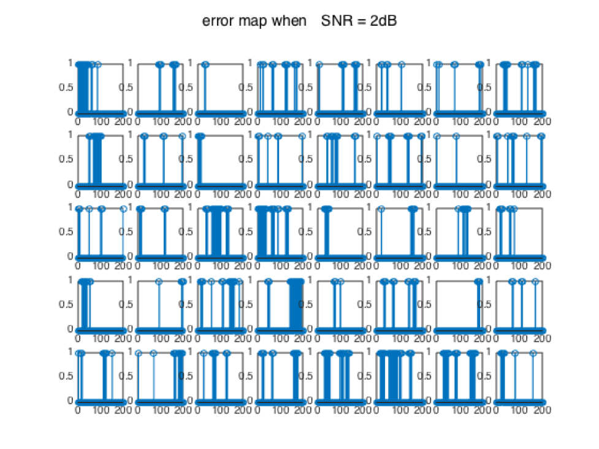
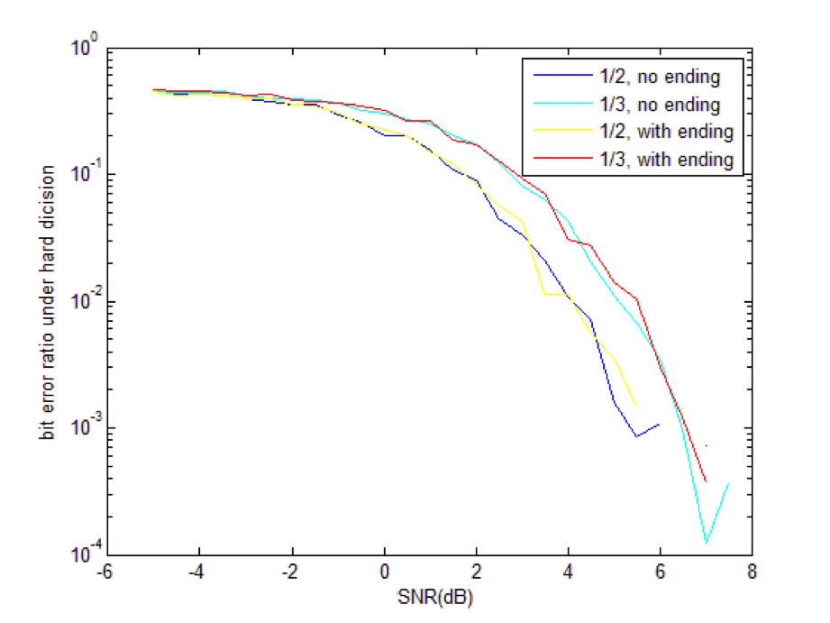
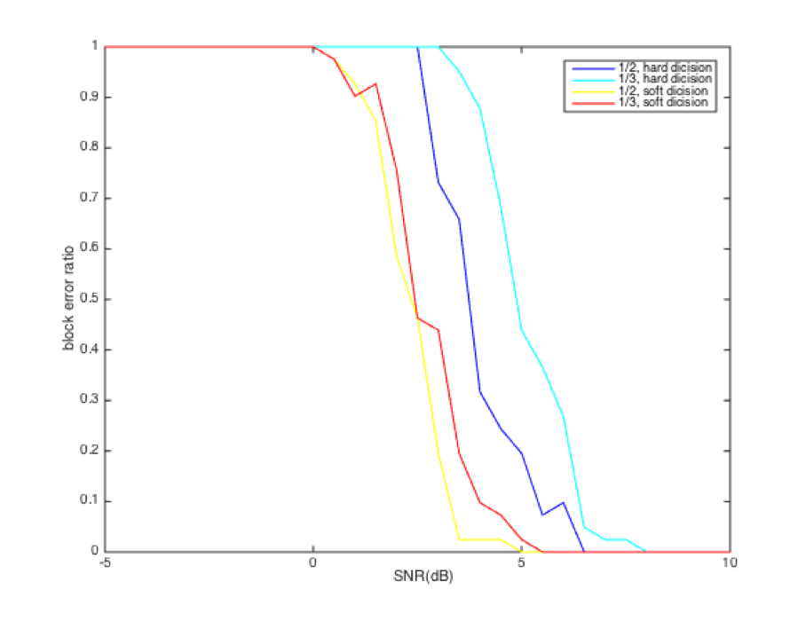
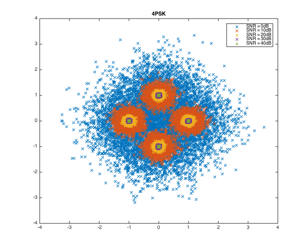
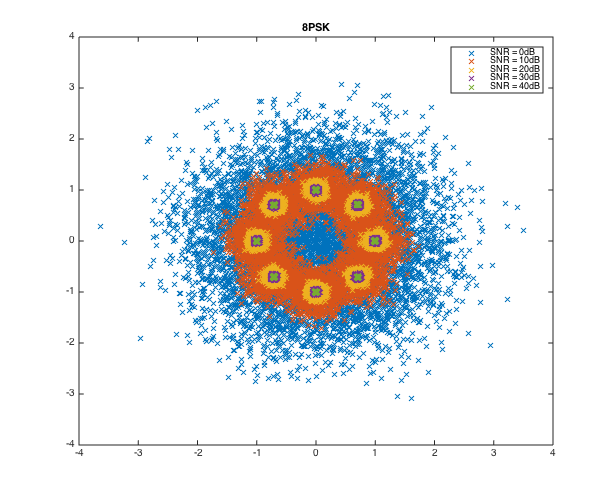

##信道编码

####无37

####刘家硕

####2013011212

---

###Part I API

1. 卷积码编码

    函数：`conv_encode`

    + input：

        `original_symbols`：原始未编码 0 1 序列 [column vector]

        `ifHasEnd`：是否有收尾 [bool]

        `efficiency`：效率 [2 or 3]

        `CRCpoly`：CRC多项式 [column vector]

    + output：

        `symbols`：编码后的 0 1 序列 [column vector]

    功能：实现对原序列不同效率的卷积码编码

    函数：`crc_encode`

    + input：

        `symbols`：原始 0 1 符号序列 [column vector]

        `crc_poly`：CRC多项式 [column vector]

        `frame_size`：帧长度 [int]

    + output：

        `crced_symbols`：添加 CRC 后的符号序列 [column vector]

    功能：添加 CRC ，并用于检测误块率。

2. 符号-电平映射

    函数：`sym_encode`

    + input：

        `symbols`：卷积码编码后的符号 [column vector]

        `efficiency`：效率 [2 or 3]

    + output：

        `signal`：经过映射后的复电平 [complex column vector]

    功能：对 1/2 效率采用 4PSK 映射，对 1/3 效率 8PSK。得到输入信道的复电平。

3. 信道模拟

    函数：`transmit`

    + input：

        `signal`：原始经过电平映射的复电平 [complex column vector]

        `snr`：信道信噪比 [double]

    + output：

        `noised_signal`：信道输出复电平 [complex column vector]

    功能：模拟信道对信号添加可控功率的噪声

4. 接收信号并进行软/硬判决（译码） ***\*我负责的部分***

    函数：`conv_decode`

    + input：

        `signal`：经过有噪信道后的复电平 [complex column vector]

        `ending`：是否有结尾 [bool]

        `efficiency`：效率 [2 or 3]

        `crc_poly`：CRC多项式 [column vector] ***\*此部分属于CRC编解码，为李思涵同学负责（对原解码函数加以改进）***

        `hard`：是否进行硬判决（`false` 则为软判决） [bool]

    + output：

        `symbols`：判决后的 0 1 符号序列 [column vector]

        `err_rate`：误块率 [double] ***\*此部分属于CRC编解码，为李思涵同学负责（对原解码函数加以改进）***

    功能：将收到的复电平译码为 0 1 序列并比较误块率

    函数：`crc_decode`

    + input：

        `crced_symbols`：加 CRC 后的符号序列 [column vector]

        `crc_poly`：CRC多项式 [column vector]

        `frame_size`：帧长 [int]

    + output：

        `symbols`：原符号序列 [column vector]

        `err_rate`：误块率 [double]

    对有 CRC 的序列恢复其原序列，计算误块率。

---

###Part II 功能实现

列写我负责部分的代码

`conv_decode`

```matlab
function [symbols, err_rate] = conv_decode( signal, ending, efficiency, crc_poly, hard )

if efficiency == 2
	A = [1 0 1 1; 1 1 1 1]';
else
	A = [1 1 0 1; 1 0 1 1; 1 1 1 1]';
end

tails = [0 0 0; 0 0 1; 0 1 0; 0 1 1; 1 0 0; 1 0 1; 1 1 0; 1 1 1];
prev_dis = [0 -1 -1 -1 -1 -1 -1 -1];
dis = [-1 -1 -1 -1 -1 -1 -1 -1];
prev_sym = cell(1,8);
sym = cell(1,8);

for i = 1:length(signal)
	for k = 1:8
		if prev_dis(k) >= 0
			for symbol = [0,1]
				input = [tails(k,:), symbol];
				output = mod(input * A,2);
				idx = find(ismember(tails,input(end-2:end),'rows'));
				d = conv_dis(output,signal(i),efficiency,hard);
				if dis(idx) < 0
					dis(idx) = prev_dis(k) + d;
					sym{idx} = [prev_sym{k}, symbol];
				elseif dis(idx) > prev_dis(k) + d
					dis(idx) = prev_dis(k) + d;
					sym{idx} = [prev_sym{k}, symbol];
				end
			end
		end
	end
	prev_sym = sym;
	prev_dis = dis;
	dis = [-1 -1 -1 -1 -1 -1 -1 -1];
end

if ending
	symbols = sym{1}';
    symbols = symbols(1:end-3);  % Remove ending.
else
	symbols = sym{find(prev_dis==min(prev_dis),1)}';
end

if any(crc_poly)
    [symbols, err_rate] = crc_decode(symbols, crc_poly, 25 * 8);
else
    err_rate = 0;
end
```

软硬判决区别主要在 `conv_dis` 函数上，一个采用欧氏距离一个采用汉明距离

`conv_dis`

```matlab
function dis = conv_dis( output, signal, efficiency, hard )

if efficiency == 2
	symbols = [0 0; 0 1; 1 1; 1 0];
else
	symbols = [0 0 0; 0 0 1; 0 1 1; 0 1 0; 1 1 0; 1 1 1; 1 0 1; 1 0 0];
end
V = zeros(length(symbols), 1);
for i = 1:2^efficiency
	V(i) = exp(1j*2*pi/(2^efficiency)*(i-1));
end

if hard
	distances = abs(V - signal);
	idx = find(distances==min(distances),1);
	dis = sum(abs(output-symbols(idx,:)));
else
	idx = ismember(symbols,output,'rows');
	dis = abs(V(idx)-signal);
end

end
```

在译码模块的循环中调用了 `ismember` `find` 等函数导致算法效率低下，考虑之后采用索引映射的方法优化。

---

###Part III 实验结果及分析

1. 典型误码图案

    

    图为 1/2 效率，with CRC，分块的误码图案，这张图的 SNR 为 2dB

    + 从图中可以看出经过卷积码编码的序列在信道中出错往往连续出现；

    + 当 SNR 值略低于一个阈值后，误码迅速大量出现。（结合其他信噪比的误码图案）

2. 误比特率

    

    在有收尾情况下得到的误比特率随 SNR 变化的图像，对比了不同效率不同判决方法的区别

    + 首先是误比特率随 SNR 变化的关系，可见随 SNR 增大过一个阈值后误比特率迅速下降（快于指数下降速度）

    + 结尾处曲线的反常回升以及曲线不光滑都为测试样本不够多的表现，通过增加测试量可以改善

    + 图像显示软判决优于硬判决，符合期望，因为软判决在最后一步综合考量了之前所有可能路径的最近距离，而硬判则在每一次电平符号映射时抛弃了诸多信息，把复平面上的距离（实数）映射成了 0 1 之间的距离（若干bool），在这样的操作中可能错过了对最小距离的最佳解码的判断机会

    + 图像中 1/2 效率优于 1/3，在课堂展示中经老师和同学提点发现这一点可以由选用的符号电平映射采用的机制解释：4PSK 映射中的各映射点距离相比 8PSK 要大一些故误判几率会小

    

    此图为硬判决条件下，不同效率有无结尾对 误码率-SNR 曲线的影响

    + 效率对曲线的影响同上

    + 有无收尾貌似对曲线影响不大

3. 误块率

    

    + 与误码率-SNR曲线相比，误块率-SNR曲线变化更快，信噪比小于一定值后误块率恒为0（块足够大）

    + 编码效率对误块率-SNR曲线影响与之前相同，若采取其他符号电平映射方法保证星座图中各点间距相同，1/2 效率应该优于 1/3

4. 复基带星座图

    

    

    SNR = 10dB

    可见 8PSK 的星座图已经有明显混叠而 4PSK 几乎未混叠，这可以解释之前不同效率（也就是不同映射方式）对误码率-SNR曲线的影响

5. 文件传输失败率

    

    可见软判决优于硬判决 2dB 左右，原因同前
